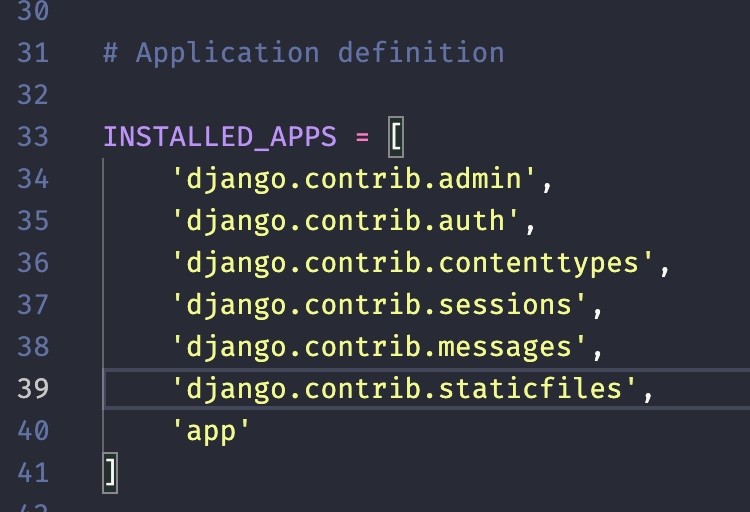
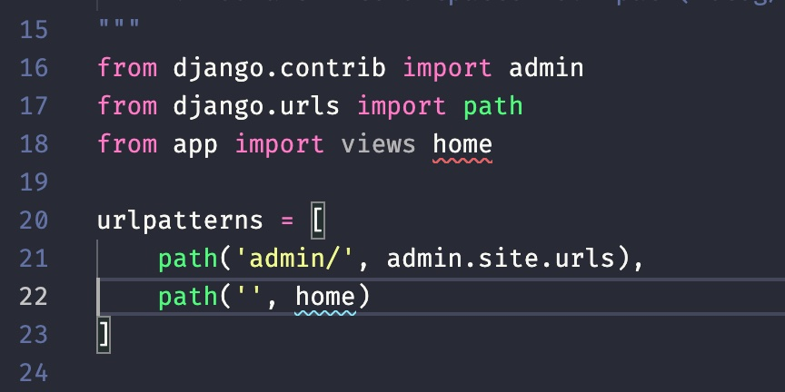

# CRUD com Python

## Criando a máquina virtual

https://packaging.python.org/guides/installing-using-pip-and-virtual-environments/#installing-virtualenv

```
python3 -m venv venv
```


## Entrando na máquina virtual

```
source venv/bin/activate
```

## Instalando o Django

```
pip install Django
```

## Criando um novo projeto no Django

```
django-admin startproject project
```


## Criando um novo app

```
python manage.py startapp app
```

## Adicionando o app criado ao arquivo de configurações

No arquivo project/settings.py adicione 'app' à lista de aplicações do projeto: 




## Adicionando a camada Views do App ao projeto

No arquivo project/urls.py adicione 'from app import views' à lista de aplicações do projeto: 




## Rodando o servidor

```
python manage.py runserver
```

## Criando templates com Django


